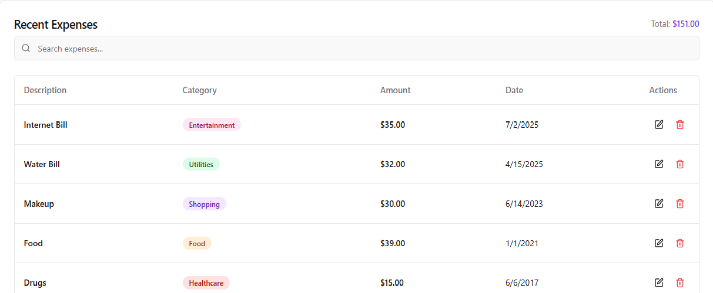
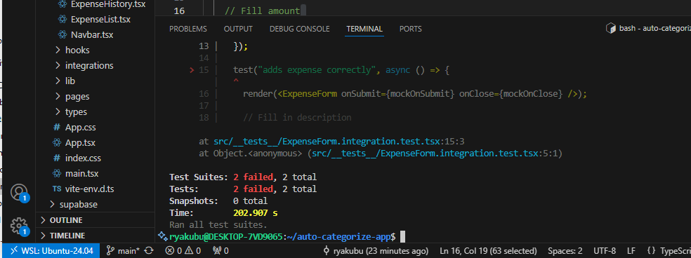

# Auto Categorize App  


📂 **Repository Link:** https://github.com/ryakubu/auto-categorize-app  
🎥 **Video Demo:** https://drive.google.com/file/d/1veVo8OI69TO_cZieShVkW3PLUM7wtIpC/view?usp=sharing  
🌐 Live Demo (Netlify): https://smartxp.netlify.app

---

An AI-powered expense tracking application that automatically suggests categories for your expenses based on the description.  


## 🚀 Features
- Add, update, and manage expenses easily.  
- AI-powered automatic category suggestion.  
- User-friendly interface with form validation.  
- Supabase integration for backend storage.  
- Unit tests with Jest and React Testing Library.
- Successfully deployed on Netlify for live usage.

---


## Tech Stack

- **Frontend**: React, TypeScript, Vite, shadcn UI components, Tailwind CSS  
- **Backend**: Supabase (Database & Auth)  
- **Testing**: Jest, React Testing Library  
- **CI/CD**: GitHub Actions, Netlify 
- **Environment Management**: `.env` file

---


## 📂 Project Setup

### 1. Clone the Repository


```bash


git clone https://github.com/ryakubu/auto-categorize-app.git
cd auto-categorize-app/auto-categorize-frontend


2. Install Dependencies
    npm install


3. Configure Environment Variables

    Create a .env file in the root of the frontend folder and add your Supabase credentials:
    VITE_SUPABASE_URL=your_supabase_url
    VITE_SUPABASE_ANON_KEY=your_supabase_anon_key


4. Run the Development Server
    npm run dev
    The app will be available at 👉 http://localhost:8080


📖 Usage

    1.	Open the application in your browser.
    2.	Fill in the expense form with:
        o	Description
        o	Amount
        o	Date
        o	(Optional) Category
    3.	The AI will automatically suggest a category based on the description.
    4.	Click Add/Update to save the expense.
    5.	Use Cancel or Close to clear or exit the form.


🧪 Testing

    Run unit tests with:
    npm run test

Tests include
    •	✅ Component rendering
    •	✅ Form submission
    •	✅ Button actions


🤝 Contributing

    Contributions are welcome! Please follow these steps:
        1.	Fork the repository.
        2.	Create a new branch:
        3.	git checkout -b feature-name
        4.	Make your changes.
        5.	Commit your changes:
        6.	git commit -m "Add feature"
        7.	Push to your branch:
        8.	git push origin feature-name
        9.	Open a Pull Request.


🙌 Acknowledgements
    •	The prototype was generated using Lovable AI.
    •	I used ChatGPT to assist with development, documentation, and improvements.


## Screenshots

### Expense Form


### AI Category Suggestion


### Test Results



